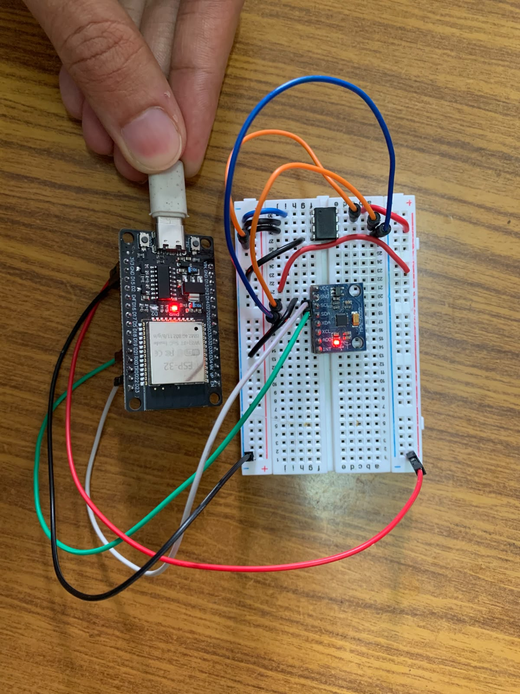

# SDHM — Self-Describing Hot-Swappable TinyML Sensor Modules

A plug-and-play edge AI platform where sensor modules carry their own trained neural network weights and a machine-readable descriptor in onboard EEPROM. A base station (ESP32) reads the descriptor on plug-in, dynamically loads the model, configures the sensor, and begins inference.

## Why This Exists

Every existing edge ML workflow hardcodes the model into firmware. Swap the sensor, reflash the board. SDHM inverts this: the model travels with the sensor. A 512-byte binary descriptor in EEPROM tells the base station everything it needs — sensor type, sampling rate, model architecture (layer types, dimensions, activations), output class labels, and a pointer to the weight blob. A custom universal inference engine parses this descriptor at runtime and executes arbitrary Conv1D/Dense architectures without TensorFlow Lite Micro or any framework dependency.

## Key Numbers

| Metric | Value |
|--------|-------|
| Descriptor size | 512 bytes |
| Model architecture | Conv1D → MaxPool1D → Dense → Dense → Softmax (7 layers) |
| Weight size | 57,296 bytes (float32) |
| Gesture classes | idle, shake_x, flick_up, twist |
| Test accuracy | 99.2% |
| Inference target | ESP32 (no PSRAM required) |

## Hardware Setup



```
ESP32 GPIO21 (SDA) ──┬── 24LC512 pin 5 ──┬── MPU6050 SDA
ESP32 GPIO22 (SCL) ──┬── 24LC512 pin 6 ──┬── MPU6050 SCL
ESP32 3.3V ──────────┬── 24LC512 pin 8 ──┬── MPU6050 VCC
ESP32 GND ───────────┬── 24LC512 pin 4 ──┬── MPU6050 GND
                      24LC512 pins 1,2,3,7 → GND

I2C at 100 kHz using the ESP32's internal pull-ups (4.7 kΩ external pull-ups to 3.3 V recommended for 400 kHz).
```

## Repo Structure

```
self-describing-tinyml-modules/
├── firmware/
│   ├── eeprom_writer/          # Arduino IDE — writes a 64 KB image to the 24LC512
│   └── universal_interpreter/  # Arduino IDE — reads the module EEPROM, runs inference, detects hot swaps
├── tools/
│   ├── flash_eeprom.py         # Sends an image to eeprom_writer page by page
│   └── make_pir_image.py       # Builds pir_eeprom_image.bin from the trained PIR model
├── eeprom_image.bin            # 64 KB EEPROM image — MPU6050 gesture module
├── pir_eeprom_image.bin        # 64 KB EEPROM image — HC-SR501 PIR presence module
├── PIR_MODULE_GUIDE.md         # PIR module + hot-swap demo
└── README.md
```
## Running the Demo

**Step 1 — Flash the EEPROM (one time per module):**

1. Arduino IDE: open `firmware/eeprom_writer/eeprom_writer.ino`, board **ESP32 Dev Module**, upload, then close the Serial Monitor.
2. Run:
```bash
   pip install pyserial
   python tools/flash_eeprom.py COM8 eeprom_image.bin        # gesture module
   python tools/flash_eeprom.py COM8 pir_eeprom_image.bin    # PIR module
```
   Wait for `DONE` and `MAGIC: OK`.

**Step 2 — Run the interpreter:**

Arduino IDE: open `firmware/universal_interpreter/universal_interpreter.ino`, upload, and open the Serial Monitor at 115200. Plug in a module; swap modules while it runs.

See [PIR_MODULE_GUIDE.md](PIR_MODULE_GUIDE.md) for the PIR module and the hot-swap demo.

## How It Works

1. The interpreter polls I2C for a 24LC512 EEPROM and reloads automatically when a module is removed or swapped
2. Reads the 512-byte descriptor — validates the magic bytes and checks the header fields are in range
3. Parses the model architecture: layer count, types (Conv1D/MaxPool1D/Dense/Flatten), dimensions, activations
4. Loads float32 weights from EEPROM into RAM
5. Initializes the sensor named in the descriptor: MPU6050 over I2C, or the HC-SR501 PIR on GPIO 34
6. Captures a window of samples, runs the forward pass, and prints the softmax output, inference time and swap timing

The inference engine is a from-scratch C++ implementation — no TFLite Micro, no CMSIS-NN, no external ML framework. It interprets arbitrary layer graphs described by the binary descriptor.

## License

MIT
